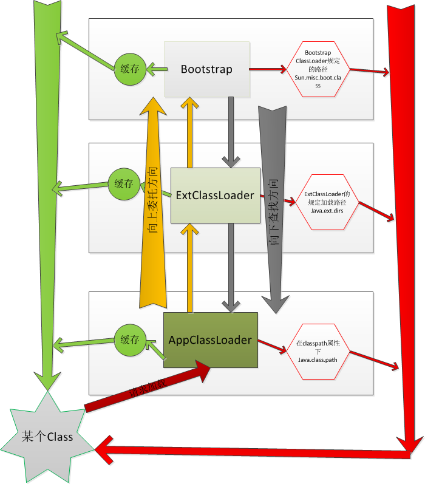

### JVM里的有几种classloader，为什么会有多种？

ClassLoader的具体作用就是将class文件加载到jvm虚拟机中去，程序就可以正确运行了。

JDK 默认提供了如下三种`Class Loader`，按照1、2、3的顺序加载。

1.  **Bootstrap loader**  最顶层的加载类，主要加载核心类库，%JRE_HOME%\lib下的rt.jar、resources.jar、charsets.jar和class等。另外需要注意的是可以通过启动jvm时指定-Xbootclasspath和路径来改变Bootstrap ClassLoader的加载目录。比如java -Xbootclasspath/a:path被指定的文件追加到默认的bootstrap路径中。

2. **Extention ClassLoader** 扩展的类加载器，加载目录%JRE_HOME%\lib\ext目录下的jar包和class文件。还可以加载-D java.ext.dirs选项指定的目录。
3. **Appclass Loader**也称为SystemAppClass 加载当前应用的classpath的所有类。


可以看sun.misc.Launcher源码，它是一个java虚拟机的入口应用。

```java
public class Launcher {
    private static URLStreamHandlerFactory factory = new Launcher.Factory();
    private static Launcher launcher = new Launcher();
    private static String bootClassPath = System.getProperty("sun.boot.class.path");
    private ClassLoader loader;
    private static URLStreamHandler fileHandler;

    public static Launcher getLauncher() {
        return launcher;
    }

    public Launcher() {
        Launcher.ExtClassLoader var1;
        try {
            var1 = Launcher.ExtClassLoader.getExtClassLoader();
        } catch (IOException var10) {
            throw new InternalError("Could not create extension class loader", var10);
        }

        try {
            this.loader = Launcher.AppClassLoader.getAppClassLoader(var1);
        } catch (IOException var9) {
            throw new InternalError("Could not create application class loader", var9);
        }

        ...

    }
}
```

Launcher初始化了ExtClassLoader和AppClassLoader。

虽然没有看见BootstrapClassLoader，但通过System.getProperty("sun.boot.class.path") 得到了字符串bootClassPath。

这个应该就是BootstrapClassLoader加载的jar包路径。

```java
// 这些打印出来的都是JRE目录下的jar包或者是class文件。
System.out.println(System.getProperty("sun.boot.class.path"));
```

结果：

```
/Library/Java/JavaVirtualMachines/jdk1.8.0_131.jdk/Contents/Home/jre/lib/resources.jar:
/Library/Java/JavaVirtualMachines/jdk1.8.0_131.jdk/Contents/Home/jre/lib/rt.jar:
/Library/Java/JavaVirtualMachines/jdk1.8.0_131.jdk/Contents/Home/jre/lib/sunrsasign.jar:
/Library/Java/JavaVirtualMachines/jdk1.8.0_131.jdk/Contents/Home/jre/lib/jsse.jar:
/Library/Java/JavaVirtualMachines/jdk1.8.0_131.jdk/Contents/Home/jre/lib/jce.jar:
/Library/Java/JavaVirtualMachines/jdk1.8.0_131.jdk/Contents/Home/jre/lib/charsets.jar:
/Library/Java/JavaVirtualMachines/jdk1.8.0_131.jdk/Contents/Home/jre/lib/jfr.jar:
/Library/Java/JavaVirtualMachines/jdk1.8.0_131.jdk/Contents/Home/jre/classes
```

BootstrapClassLoader、ExtClassLoader、AppClassLoader实际是查阅相应的环境属性`sun.boot.class.path`、`java.ext.dirs`和`java.class.path`来加载资源文件的。


### 那具体ClassLoader是怎么工作的？

先说下Bootstrap ClassLoader是由C/C++编写的，它本身是虚拟机的一部分，所以它并不是一个JAVA类，也就是无法在java代码中获取它的引用，JVM启动时通过Bootstrap类加载器加载rt.jar等核心jar包中的class文件。


是使用***双亲委托模型***的；

一个类加载器查找class和resource时，是通过“委托模式”进行的，它首先判断这个class是不是已经加载成功，如果没有的话它并不是自己进行查找，而是先通过父加载器，然后递归下去，直到Bootstrap ClassLoader，如果Bootstrap classloader找到了，直接返回，如果没有找到，则一级一级返回，最后到达自身去查找这些对象。这种机制就叫做双亲委托。

具体流程如下：




### 自定义ClassLoader

不管是Bootstrap ClassLoader还是ExtClassLoader，都是只加载指定目录下的jar包或者资源，那我们怎么去加载我们自己的jar包？

java支持使用自定义的ClassLoader。

- 自定义步骤

1. 编写一个类继承自ClassLoader抽象类。
2. 复写它的`findClass()`方法。
3. 在`findClass()`方法中调用`defineClass()`。

> **一个ClassLoader创建时如果没有指定parent，那么它的parent默认就是AppClassLoader。 **


举个栗子深入了解下

后面用户加载的MapTest.java

```java
public class MapTest {
    public static void main(String[] args) {
        HashMap<String, String> cities = new HashMap<>();

        cities.put("北京", "1000");
        cities.put("上海", "2900");
        cities.put("广州", "5810");
        cities.put("深圳", "5840");

        System.out.println(cities);

        CopyOnWriteArrayList copyOnWriteArrayList = new CopyOnWriteArrayList();
    }

    public void say() {
        System.out.println("Hello, World!");
    }
}
```

将MapTest.java编译后保存到了`/Users/tigerkim/Projects/java-example/out/production/java-example`


来一个自定义的ClassLoader，定义了class存放目录，用于加载Class，返回Class

```java
import java.io.*;

public class MyClassLoader extends ClassLoader {
    private String path;

    public MyClassLoader(String path) {
        this.path = path;
    }

    @Override
    protected Class<?> findClass(String name) throws ClassNotFoundException {
        String fileName = getFileName(name);

        try {
            InputStream is = new FileInputStream(path + name);
            ByteArrayOutputStream bais = new ByteArrayOutputStream();
            int len;
            while ((len = is.read()) != -1) {
                bais.write(len);
            }

            byte[] data = bais.toByteArray();
            bais.close();

            return defineClass(name, data, 0, data.length);

        } catch (IOException e) {
            e.printStackTrace();
        }

        return super.findClass(name);
    }

    private String getFileName(String name) {
        int index = name.lastIndexOf('.');
        if (index == -1) {
            return name + ".class";
        } else {
            return name.substring(index + 1) + ".class";
        }
    }
}
```


MapTest.class放在了`/Users/tigerkim/Projects/java-example/out/production/java-example`

我们写一个demo加载MapTest.class，然后调用`say()`

```java
import java.lang.reflect.InvocationTargetException;
import java.lang.reflect.Method;

public class ClassLoaderTest {
    public static void main(String[] args) {
        MyClassLoader myClassLoader = new MyClassLoader("/Users/tigerkim/Projects/java-example/out/production/java-example");

        try {
            Class c = myClassLoader.loadClass("MapTest");

            if (c != null) {
                try {
                    Object obj = c.newInstance();
                    Method method = c.getDeclaredMethod("say", null);
                    method.invoke(obj, null);
                } catch (InstantiationException | IllegalAccessException
                        | NoSuchMethodException
                        | SecurityException |
                        IllegalArgumentException |
                        InvocationTargetException e) {
                    // TODO Auto-generated catch block
                    e.printStackTrace();
                }
            }
        } catch (ClassNotFoundException e) {
            e.printStackTrace();
        }
    }
}
```

run后，可以看到Command输出

```
Hello, World!
```


总结下来：从指定目录加载Class，通过反射机制生成object后调用方法。


引用：

[一看你就懂，超详细java中的ClassLoader详解](https://blog.csdn.net/briblue/article/details/54973413)