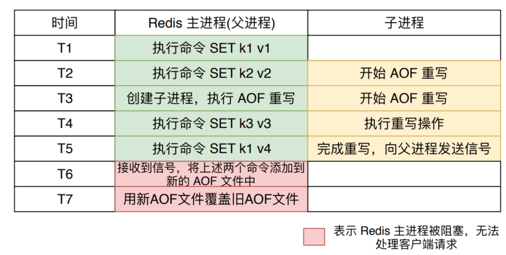

# AOF重写
随着运行时间的增长，执行的命令越来越多，会导致AOF文件越来越大，当AOF文件过大时，redis会执行重写机制来压缩AOF文件进行**瘦身减肥**。这个压缩和上面提到的RDB文件的算法压缩不同，**重写机制主要是将文件中无效的命令去除**

比如：
1. 同一个key的值，只保留最后一次写入
2. 已删除或者已过期数据相关命令会被去除
这样就避免了，aof文件过大而实际内存数据小的问题(如频繁修改数据时，命令很多，实际数据很少)

## 重写的触发方式：
1. 手动执行 bgrewriteaof 触发AOF重写，在后台（子进程）重写 AOF, 不会阻塞工作线程，能正常服务，此方法最常用。
2. 在redis.conf文件中配置重写的条件，如：
```
auto-aof-rewrite-min-size 64MB   // 当文件小于64M时不进行重写
auto-aof-rewrite-min-percenrage 100  // 当文件比上次重写后的文件大100%时进行重写
```

## 重写的过程
1. 从主进程中fork出子进程，并拿到fork时的AOF文件数据写到一个临时AOF文件中
    > 子进程进行 AOF 重写期间，Redis 进程可以继续处理客户端命令请求。
2. 在重写过程中，redis收到的命令会同时写到AOF缓冲区(旧)和重写缓冲区（新）中，这样保证重写不丢失重写过程中的命令
3. 重写完成后通知主进程，主进程会将AOF缓冲区中的数据追加到子进程生成的文件中
4. redis会原子的将旧文件替换为新文件，并开始将数据写入到新的aof文件上

在整个 AOF 后台重写过程中，只有信号处理函数执行时会对 Redis 主进程造成阻塞，在其他时候，AOF 后台重写都不会阻塞主进程。


## 具体操作过程
在AOF 重写期间，主进程创建一个新的aof_buf，新文件用于接收新写入的命令，在AOF重写期间，系统向两个aof_buf同时追加新写入的命令。
当主进程收到子进程重写AOF文件完成后，停止向老的aof_buf追加命令，然后删除旧的AOF文件；将将子进程新生成的AOF文件重命名为appendonly.aof.last

具体流程如下：
1. 停止向旧的aof_buf追加命令；
2. 删除旧的的appendonly.aof.last文件；
3. 交换两个aof_buf的指针；
4. 回收旧的aof_buf
5. 重命令子进程生成的AOF文件为appendonly.aof.last。
